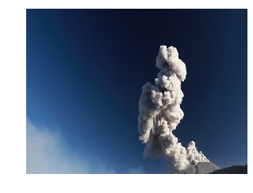
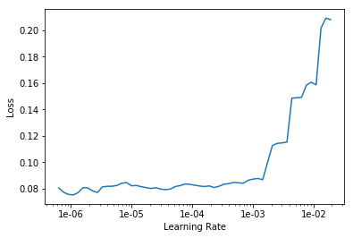
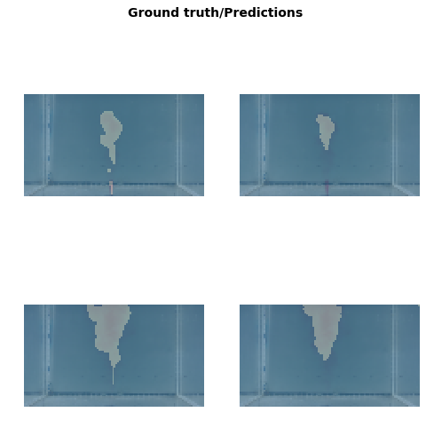
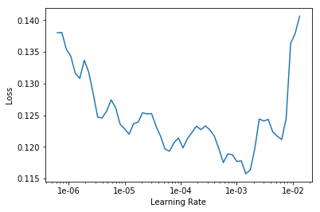
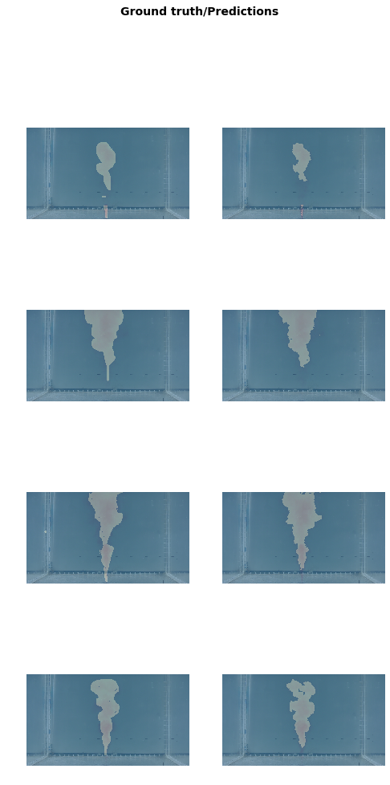

## Image segmentation with CamVid


```python
%reload_ext autoreload
%autoreload 2
%matplotlib inline
```


```python
from fastai.vision import *
from fastai.callbacks.hooks import *
from fastai.utils.mem import *
from fastai import*
import numpy as np
```


```python
suffixe = ''
path_lbl = 'data%s/labels/'% suffixe 
path_img = 'data%s/images/'% suffixe 
```

# Importing data

- Server: Import .mat to raw_data/matlab 
- Import.mat : Create labels files in raw_data folder and images in data_th
- Adapted Mask : Change the labels files format 

## Look at the data


```python
img_f = path_img+'mask4_00021.png'
img = open_image(img_f)
img.show(figsize=(5,5))
```





```python
get_label = lambda x: path_lbl+x.stem+x.suffix
```


```python
mask = open_mask('data%s/labels/mask4_00021.png'%suffixe )
mask.show(figsize=(5,5), alpha=1)
```


```python
src_size = np.array(mask.shape[1:])
mask.data
```


    tensor([[[0, 0, 0,  ..., 0, 0, 0],
             [0, 0, 0,  ..., 0, 0, 0],
             [0, 0, 0,  ..., 0, 0, 0],
             ...,
             [0, 0, 1,  ..., 1, 0, 0],
             [0, 0, 0,  ..., 0, 0, 0],
             [0, 0, 0,  ..., 0, 0, 0]]])


## Datasets


```python
classes = np.array(['other','plume'],dtype='<U17')
```


```python
size = src_size//6
bs = 4
gc.collect()
```


    3933


```python
# Choosing the validation set(s)
set_number = [] # Change this to choose your validation files
valid_names = [] # Not this !
for root, dirs, files in os.walk(path_img):
    files = sorted(files)
    for filename in files: 
        if filename[:4] == 'mask': # verify that its not a weird file
            if int(filename[4]) in set_number:
                valid_names.append(filename)
```


```python
src = (SegmentationItemList.from_folder(path_img)
       .split_by_files(valid_names)
       .label_from_func(get_label, classes=classes))
src
```

    /opt/anaconda3/lib/python3.7/site-packages/fastai/data_block.py:445: UserWarning: Your validation set is empty. If this is by design, use `split_none()`
                     or pass `ignore_empty=True` when labelling to remove this warning.
      or pass `ignore_empty=True` when labelling to remove this warning.""")


    LabelLists;
    
    Train: LabelList (51 items)
    x: SegmentationItemList
    Image (3, 360, 640),Image (3, 360, 640),Image (3, 360, 640),Image (3, 360, 640),Image (3, 360, 640)
    y: SegmentationLabelList
    ImageSegment (1, 360, 640),ImageSegment (1, 360, 640),ImageSegment (1, 360, 640),ImageSegment (1, 360, 640),ImageSegment (1, 360, 640)
    Path: data_exp/images;
    
    Valid: LabelList (0 items)
    x: SegmentationItemList
    
    y: SegmentationLabelList
    
    Path: data_exp/images;
    
    Test: None


```python
data = (src.transform(get_transforms(), size=size, tfm_y=True)
        .databunch(bs=bs)
        .normalize(imagenet_stats))
```


```python
#data.show_batch(2, imsize = 3)
```

## Model


```python
#name2id = {v:k for k,v in enumerate(classes)}
#void_code = name2id['Void']

def acc_camvid(input, target):
    target = target.squeeze(1)
    mask = target #!= void_code
    return (input.argmax(dim=1)[mask]==target[mask]).float().mean()
```


```python
#metrics=acc_camvid
wd=1e-2
```


```python
learn = unet_learner(data, models.resnet34, wd=wd)
```


```python
lr_find(learn)
learn.recorder.plot()
```


    LR Finder is complete, type {learner_name}.recorder.plot() to see the graph.





```python
lr=1e-4
```


```python
learn.fit_one_cycle(8, lr)
```


<table border="1" class="dataframe">
  <thead>
    <tr style="text-align: left;">
      <th>epoch</th>
      <th>train_loss</th>
      <th>valid_loss</th>
      <th>time</th>
    </tr>
  </thead>
  <tbody>
    <tr>
      <td>0</td>
      <td>0.325488</td>
      <td>0.239331</td>
      <td>00:01</td>
    </tr>
    <tr>
      <td>1</td>
      <td>0.244409</td>
      <td>0.150072</td>
      <td>00:01</td>
    </tr>
    <tr>
      <td>2</td>
      <td>0.189196</td>
      <td>0.087637</td>
      <td>00:01</td>
    </tr>
    <tr>
      <td>3</td>
      <td>0.157806</td>
      <td>0.081171</td>
      <td>00:01</td>
    </tr>
    <tr>
      <td>4</td>
      <td>0.138000</td>
      <td>0.066944</td>
      <td>00:01</td>
    </tr>
    <tr>
      <td>5</td>
      <td>0.123738</td>
      <td>0.069653</td>
      <td>00:01</td>
    </tr>
    <tr>
      <td>6</td>
      <td>0.112602</td>
      <td>0.062430</td>
      <td>00:01</td>
    </tr>
    <tr>
      <td>7</td>
      <td>0.104042</td>
      <td>0.061915</td>
      <td>00:01</td>
    </tr>
  </tbody>
</table>


```python
learn.show_results(rows=2, imsize = 2)
```





```python
learn.save('stage-1');
```

## Go big

You may have to restart your kernel and come back to this stage if you run out of memory, and may also need to decrease `bs`.


```python
size = src_size

free = gpu_mem_get_free_no_cache()
# the max size of bs depends on the available GPU RAM
if free > 8200: bs=3
else:           bs=4
print(f"using bs={bs}, have {free}MB of GPU RAM free")
```

    using bs=4, have 6578MB of GPU RAM free


```python
data = (src.transform(get_transforms(), size=size, tfm_y=True)
        .databunch(bs=bs)
        .normalize(imagenet_stats))
```


```python
learn = unet_learner(data, models.resnet34, wd=wd)
```


```python
learn.load('stage-1');
```


```python
lr_find(learn)
learn.recorder.plot()
```


    LR Finder is complete, type {learner_name}.recorder.plot() to see the graph.





```python
lr=4e-4
```


```python
learn.fit_one_cycle(10,lr)
```


<table border="1" class="dataframe">
  <thead>
    <tr style="text-align: left;">
      <th>epoch</th>
      <th>train_loss</th>
      <th>valid_loss</th>
      <th>time</th>
    </tr>
  </thead>
  <tbody>
    <tr>
      <td>0</td>
      <td>0.109332</td>
      <td>0.086213</td>
      <td>00:13</td>
    </tr>
    <tr>
      <td>1</td>
      <td>0.106726</td>
      <td>0.157072</td>
      <td>00:11</td>
    </tr>
    <tr>
      <td>2</td>
      <td>0.103552</td>
      <td>0.079714</td>
      <td>00:11</td>
    </tr>
    <tr>
      <td>3</td>
      <td>0.101116</td>
      <td>0.052404</td>
      <td>00:11</td>
    </tr>
    <tr>
      <td>4</td>
      <td>0.095342</td>
      <td>0.058425</td>
      <td>00:11</td>
    </tr>
    <tr>
      <td>5</td>
      <td>0.089358</td>
      <td>0.050816</td>
      <td>00:11</td>
    </tr>
    <tr>
      <td>6</td>
      <td>0.084493</td>
      <td>0.048629</td>
      <td>00:11</td>
    </tr>
    <tr>
      <td>7</td>
      <td>0.081611</td>
      <td>0.050156</td>
      <td>00:11</td>
    </tr>
    <tr>
      <td>8</td>
      <td>0.079458</td>
      <td>0.051008</td>
      <td>00:11</td>
    </tr>
    <tr>
      <td>9</td>
      <td>0.077706</td>
      <td>0.050762</td>
      <td>00:11</td>
    </tr>
  </tbody>
</table>


```python
learn.show_results(rows=4)
```





```python
learn.save('sgm_learner_exp');
```

# Save preditions


```python
from PIL import Image
import matplotlib.pyplot as plt
```


```python
path_pred = 'raw_data/predictions_exp/'
!rm -r $path_pred
!mkdir $path_pred
```


```python
def save_preds(dl):
    i=0
    names = dl.dataset.items
    for batch in dl:
        preds = learn.pred_batch(batch=batch, reconstruct=True)
        for o in preds:
            o.save(path_pred+names[i].name)
            i += 1
```


```python
save_preds(data.fix_dl);
```


```python
def substract_mask(img, mask):
    pixelsMask = mask.load()
    pixelsNew = img.load()
    for i in range(img.size[0]):
        for j in range(img.size[1]):
            if pixelsMask[i,j][0] >240:
                pixelsNew[i,j] = (0,0,0)
    return(img)
```


```python
#for root, dirs, files in os.walk(path_img):
#    for filename in files:
#        if filename[:4] == 'mask':
#            img = Image.open(path_img+filename)
#            mask = Image.open(path_pred+filename)
#            new_img = substract_mask(img, mask)
#            new_img.save(path_pred+filename)
            
```

# Predict test folder


```python
src_test = (SegmentationItemList.from_folder('raw_data/test/')
       .split_none()
      .label_empty())

data_test = (src.transform(get_transforms(max_rotate=0, do_flip = False), size=size)
        .databunch(bs=bs)
        .normalize(imagenet_stats))
data_test;
```


```python
img = data_test.train_ds[1][0]
#img.show(y=learn.predict(img)[0], figsize = (8,8))
img_pred = learn.predict(img)[0]
img
```


    ---------------------------------------------------------------------------

    NameError                                 Traceback (most recent call last)

    <ipython-input-84-7092467699e1> in <module>
    ----> 1 img = data_test.train_ds[1][0]
          2 #img.show(y=learn.predict(img)[0], figsize = (8,8))
          3 img_pred = learn.predict(img)[0]
          4 img


    NameError: name 'data_test' is not defined


```python
img_pred
```


